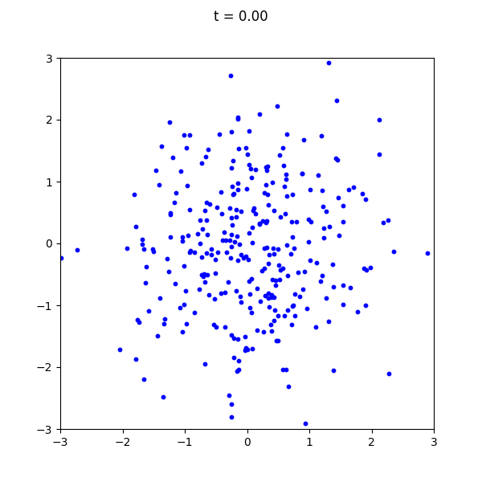
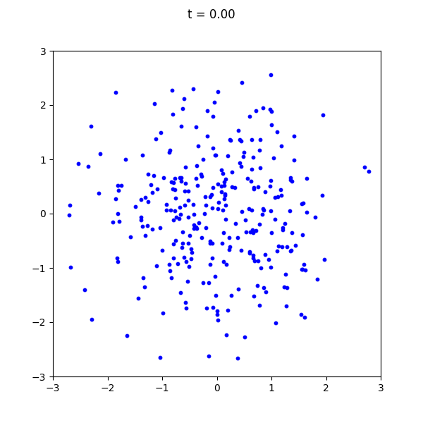
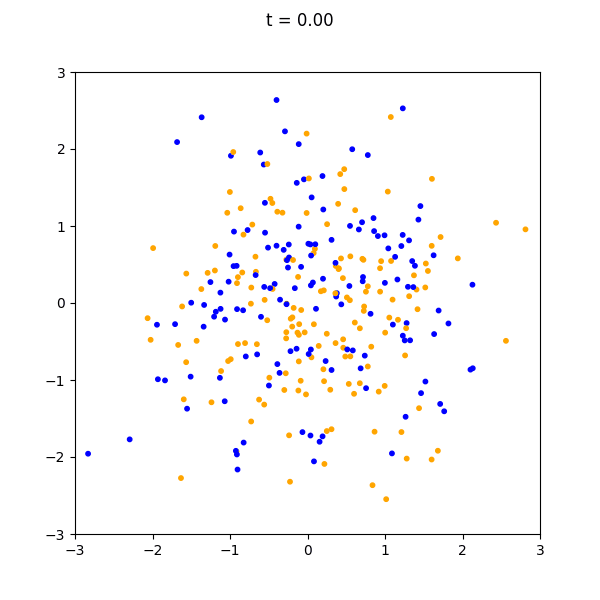
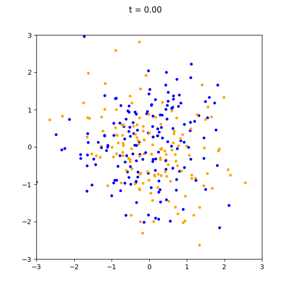
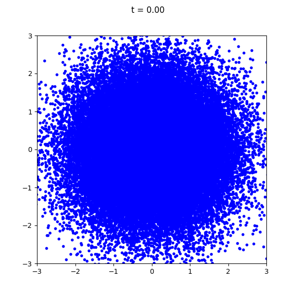
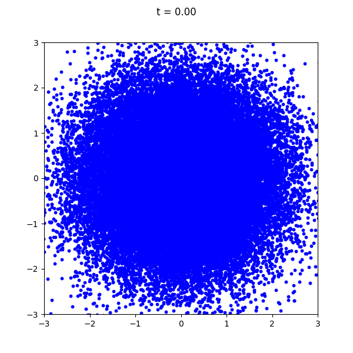

# Flow Matching Lab

A **minimal course + playground** for learning **generative flow models** from scratch.  
It focuses on **explicit training loops and small experiments** instead of large frameworks to reveal how generative models work.

> ⚠️ **Private repo:** do not share. Students will work from a public version with skeleton code and Colab notebooks.

## 1. Two Moons
### Unconditional
```bash
# Rectified Flow
python train.py
python sample.py

# DDIM
python train.py --DDIM
python sample.py --checkpoint output/TwoMoons_ddim.pth --gif output/TwoMoons_ddim.gif
```

<table>
  <tr>
    <td align="center">
      <br>
      <b>Rectified Flow</b>
    </td>
    <td align="center">
      <br>
      <b>DDIM</b>
    </td>
  </tr>
</table>

### Conditional
```bash
# Rectified Flow
python train.py --conditional
python sample.py --checkpoint output/TwoMoons_cond.pth --gif output/TwoMoons_cond.gif

# DDIM
python train.py --conditional --DDIM
python sample.py --checkpoint output/TwoMoons_cond_ddim.pth --gif output/TwoMoons_cond_ddim.gif
```

<table>
  <tr>
    <td align="center">
      <br>
      <b>Rectified Flow</b>
    </td>
    <td align="center">
      <br>
      <b>DDIM</b>
    </td>
  </tr>
</table>


## 2. Chessboard
### Unconditional
```bash
# Rectified Flow
python train.py --dataset "ChessBoard" --model_config '{"model" : "MLP", "h" : 512}' --lr 1e-3
python sample.py --n_samples 50000 --model_config '{"model" : "MLP", "h" : 512}' --checkpoint output/ChessBoard.pth --gif output/ChessBoard.gif

# DDIM
python train.py --dataset "ChessBoard" --DDIM --model_config '{"model" : "MLP", "h" : 512}' --lr 1e-3
python sample.py --n_samples 50000 --model_config '{"model" : "MLP", "h" : 512}' --checkpoint output/ChessBoard_ddim.pth --gif output/ChessBoard_ddim.gif
```

<table>
  <tr>
    <td align="center">
      <br>
      <b>Rectified Flow</b>
    </td>
    <td align="center">
      <br>
      <b>DDIM</b>
    </td>
  </tr>
</table>

### Conditional
```bash
# Rectified Flow
python train.py --dataset "ChessBoard" --model_config '{"model" : "MLP", "h" : 512}' --lr 1e-3 --conditional
python sample.py --n_samples 50000 --model_config '{"model" : "MLP", "h" : 512}' --checkpoint output/ChessBoard_cond.pth --gif output/ChessBoard_cond.gif

# DDIM
python train.py --dataset "ChessBoard" --model_config '{"model" : "MLP", "h" : 512}' --lr 1e-3 --conditional --DDIM
python sample.py --n_samples 50000 --model_config '{"model" : "MLP", "h" : 512}' --checkpoint output/ChessBoard_cond_ddim.pth --gif output/ChessBoard_cond_ddim.gif
```

<table>
  <tr>
    <td align="center">
      <br>
      <b>Rectified Flow</b>
    </td>
    <td align="center">
      <br>
      <b>DDIM</b>
    </td>
  </tr>
</table>

## 3. MNIST
### Unconditional
```bash
# Rectified Flow
python train.py --dataset "MNIST" --model_config '{"model" : "UNet"}' --lr 1e-3 --batch_size=256
python sample.py --n_samples 16 --model_config '{"model" : "UNet"}' --checkpoint output/MNIST.pth --gif output/MNIST.gif

# DDIM
python train.py --dataset "MNIST" --model_config '{"model" : "UNet"}' --lr 1e-3 --batch_size=256 --DDIM
python sample.py --n_samples 16 --model_config '{"model" : "UNet"}' --checkpoint output/MNIST_ddim.pth --gif output/MNIST_ddim.gif
```

<table>
  <tr>
    <td align="center">
      <br>
      <b>Rectified Flow</b>
    </td>
    <td align="center">
      <br>
      <b>DDIM</b>
    </td>
  </tr>
</table>

### Conditional
```bash
# Rectified Flow
python train.py --dataset "MNIST" --model_config '{"model" : "UNet"}' --lr 1e-3 --batch_size=256 --conditional
python sample.py --n_samples 16 --model_config '{"model" : "UNet"}' --checkpoint output/MNIST_cond.pth --gif output/MNIST_cond.gif

# DDIM
python train.py --dataset "MNIST" --model_config '{"model" : "UNet"}' --lr 1e-3 --batch_size=256 --conditional --DDIM
python sample.py --n_samples 16 --model_config '{"model" : "UNet"}' --checkpoint output/MNIST_cond_ddim.pth --gif output/MNIST_cond_ddim.gif
```

<table>
  <tr>
    <td align="center">
      <br>
      <b>Rectified Flow</b>
    </td>
    <td align="center">
      <br>
      <b>DDIM</b>
    </td>
  </tr>
</table>


